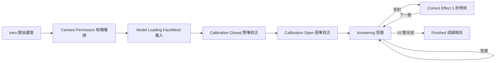

# 台灣常識嘴巴快問快答

使用 p5.js、ml5.js FaceMesh 與 webcam 製作的 10 題台灣常識是非題小遊戲。玩家用嘴巴作答：張大嘴代表 `YES`，自然閉嘴代表 `NO`。

## 操作方式

1. 用 VS Code 開啟這個資料夾。
2. 在終端機執行：

   ```bash
   python3 -m http.server 8000
   ```

3. 用瀏覽器開啟 `http://localhost:8000`。
4. 按下「開始遊戲」，允許瀏覽器使用 webcam。
5. 依畫面指示完成校正：
   - 自然閉嘴 1 秒。
   - 張大嘴 1 秒。
6. 題目出現後開始作答。

## 遊戲規則

- 題目主題是台灣常識，共 10 題。
- 每一題都是是非題，畫面會提示「請作答」。
- 張大嘴代表 `YES`，閉上嘴代表 `NO`。
- 答對會顯示 3 秒台灣主題特效與知識卡，再進入下一題。
- 答錯不換題，畫面會顯示提示，請再做一次嘴巴動作。
- 遊戲結束後會顯示首答分數、錯誤嘗試次數與錯題複習。

## 技術說明

- p5.js 負責 webcam 影像、HUD、動畫特效、RWD canvas 與所有遊戲畫面繪製。
- ml5.js FaceMesh 負責偵測臉部關鍵點，程式取上唇與下唇中心點計算嘴巴開合比例。
- 遊戲開始前會做個人化校正，記錄使用者「閉嘴」與「張嘴」比例，再自動算出 `YES` / `NO` 判斷門檻。
- 答題時會顯示嘴巴開合值與穩定度，`NO` 需要更長穩定幀數，降低自然閉嘴造成的誤觸。
- 程式使用明確狀態機管理流程，避免相機、模型、校正、答題與結果畫面互相混在一起。

## 狀態流程



## 設計亮點

- 個人化校正：不用固定嘴巴開合數值，能適應不同使用者臉型與鏡頭距離。
- 防誤觸：`NO` 需要較長穩定度，避免一般閉嘴看鏡頭時太快送出答案。
- 可視化偵測：畫面顯示嘴巴開合值、YES/NO 門檻與穩定度條。
- 台灣主題特效：答對時出現台灣輪廓、粒子與知識補充卡。
- 結果報告：最後顯示首答分數、錯誤嘗試與錯題複習，而不是只顯示總分。
- RWD：桌機與手機都能看到題目、請作答、YES/NO 規則、答錯提示與結果報告。

## 注意

webcam 通常需要在 `localhost` 或 HTTPS 環境才可使用。若直接雙擊 `index.html` 用 `file://` 開啟，瀏覽器可能會擋下相機權限。

## 建議驗證方式

- 確認瀏覽器成功取得 webcam 權限。
- 確認閉嘴與張嘴校正都會完成。
- 確認每題都會顯示「請作答」。
- 確認張嘴會送出 `YES`，閉嘴穩定後會送出 `NO`。
- 確認答對會停留約 3 秒再進入下一題。
- 確認答錯時不換題，並會顯示提示。
- 確認第 10 題後顯示成績報告。
